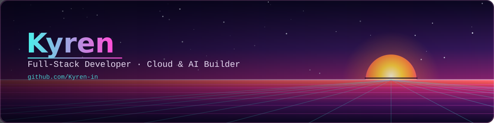

  

<h1 align="center">Hey there, I'm JYOTIRMAY DAS 👋</h1>

  <i>CS Student · Future Software Developer · Building & Learning</i>

  
  

---

### 👨‍💻 About Me

- 🎓 Computer Science student passionate about technology and software development
- 🌱 Currently learning **C Programming, DSA, and Git/GitHub**
- 💻 Exploring **Software Development, Web Development, and Open Source**
- 🚀 Building projects while improving my problem-solving skills
- 🎯 Goal: Become a skilled software developer and build impactful products
- ⚡ Always curious and eager to learn something new

---

### 🛠️ Current Stack

  

### 🌱 Currently Exploring

  

---

### 🎯 Current Goals

- 📊 Master **Data Structures & Algorithms**
- 💻 Build **3–5 complete real-world projects**
- 🌐 Learn modern **Web & Software Development**
- 🚀 Make my first meaningful **Open Source contribution**
- 📈 Stay consistent and improve every day

---

### 🐍 Contribution Snake

  <picture>
    <source
      media="(prefers-color-scheme: dark)"
      srcset="https://raw.githubusercontent.com/Kyren-in/Kyren-in/output/github-contribution-grid-snake-dark.svg"
    />
    <source
      media="(prefers-color-scheme: light)"
      srcset="https://raw.githubusercontent.com/Kyren-in/Kyren-in/output/github-contribution-grid-snake.svg"
    />
    
  </picture>

---

### 🌐 Let's Connect

  <!-- Replace # with your real profile links -->
  
  
  

  <i>Thanks for stopping by — see you in the next commit 🚀</i>

